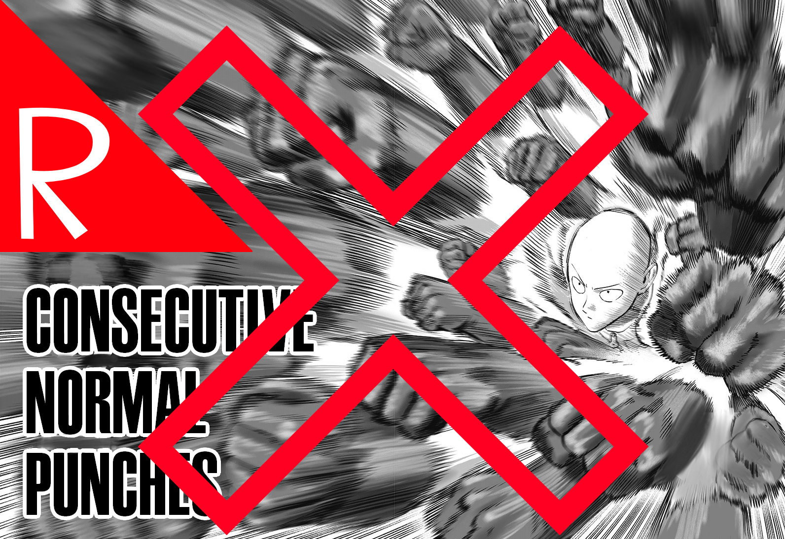

# Quasimorph Cap Attacks

Limits enemy units to a maximum of two *melee* attacks per turn.  This affects fast moving units such as spiders that have four AP.

For example, a four AP unit like a spider can still move up to four spaces, but it can only use up to two of its four AP to attack.  

Examples:
* Move 4, Attack 0
* Move 0, Attack 2
* Move 2, Attack 2

This only affects melee attacks and not ranged attacks.

# Vs. Game Difficulty
This differs from the game's difficulty settings as it does not reduce the total number of AP's, just the max melee attacks.

# Save
Save to add or remove at anytime.

# Support
If you enjoy my mods and want to buy me a coffee, check out my [Ko-Fi](https://ko-fi.com/nbkredspy71915) page.
Thanks!

# Source Code
Source code is available on GitHub at https://github.com/NBKRedSpy/QM_CapAttack
